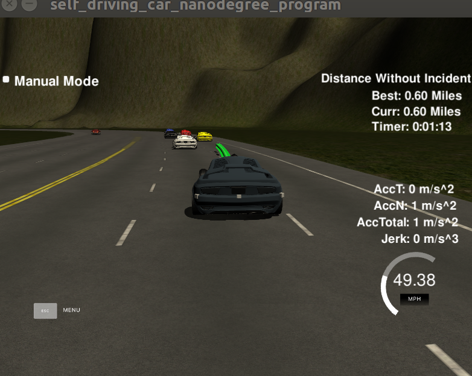
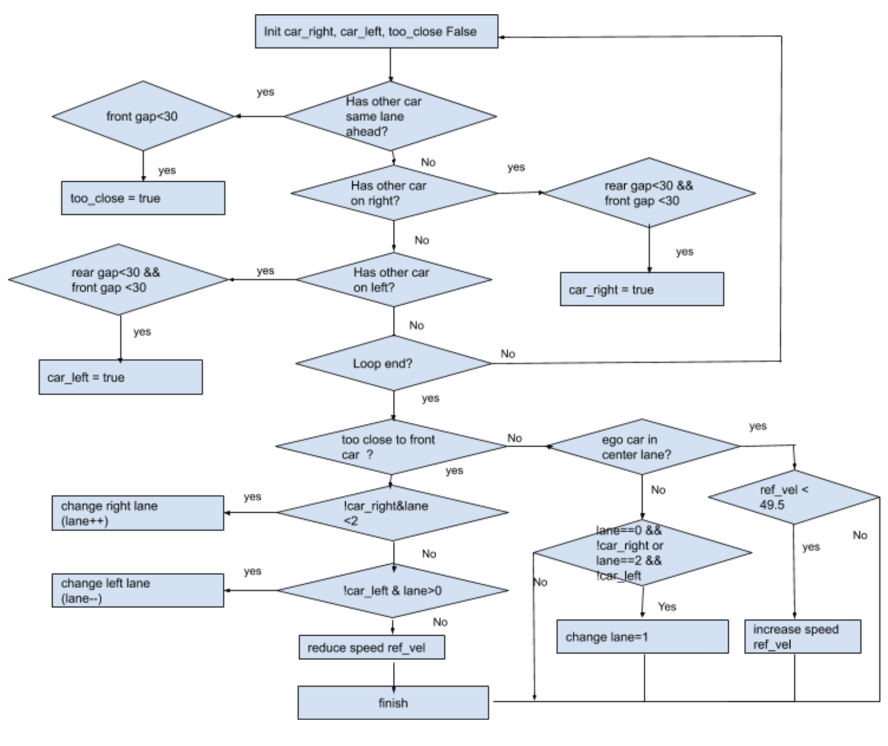
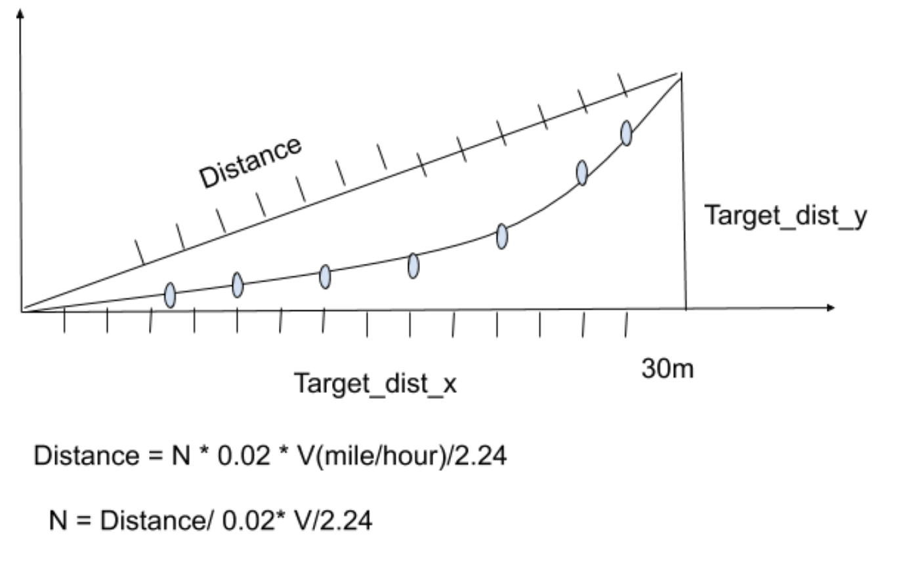

# Path Planning Simulation



[Click here](https://youtu.be/EtD_Qjt8mTM) for a video.

## Overview

In this project we design a path planner that is able to create smooth and safe paths for the car to follow along a three lane highway with traffic. A successful path planner will be able to keep inside its lane, avoid hitting other cars, and pass slower moving traffic all by using localization, sensor fusion, and map data.

The goals of this project are the followings:
* The vehicle must safely navigate around a virtual highway
* The vehicle should drive as close as possible to the 50 MPH speed limit and pass slower traffic
* The vehicle should avoid hitting other cars and drive inside of the marked road lane
* The vehicle should be able to make one complete loop around the 6946m highway
* The vehicle should not experience total acceleration over 10 m/s^2 and jerk that is greater than 10 m/s^3

The project comes with a list of waypoints around the highway. For all cars, localization and sensor fusion data are provided.


## Prerequisites

The project has the following dependencies (from Udacity's seed project):
* cmake >= 3.5
* make >= 4.1
* gcc/g++ >= 5.4
* libuv 1.12.0
* Udacity's term3 simulator

Once the simulator started
1. Clone this repo.
2. Make a build directory: mkdir build && cd build
3. Compile: cmake .. && make
4. Run it: ./path_planning

## Implementation

For this project, I have used the Path Planning Project Starter Code from Udacity. The main.cpp has all the code changes. Besides that the spline.h file was included from http://kluge.in-chemnitz.de/opensource/spline/


### 1. Prediction and Decision

This step looks for the closest cars: the car in front of the ego vehicle and the car just behind the ego vehicle for every lane. By using the sensor fusion data the program can detect the position of other vehicles around us. The code uses this information to measure the distance of cars. If ego car gets too close to the car in front of it then decelerate the vehicle and try to pass it by changing lanes. For instance, if a car on the left or right lane is 30 waypoints behind us then set the left_lane_car or right_lane_car in in main.cpp to true and prevent the vehicle from changing lanes.

The key data structure sensor_fusion is a 2d vector which has following fields:
* car's unique ID,
* car's x position in map coordinates
* car's y position in map coordinates
* car's x velocity in m/s
* car's y velocity in m/s
* car's s position in frenet coordinates
* car's d position in frenet coordinates
A sample sensor_fusion is like this

```cpp
...

[0,1028.214,1148.148,19.12857,8.593667,243.1204,10.14141],[1,1090.842,1181.932,19.95762,5.89691,314.2516,1.103784],
[2, 832.3537, 1128.152, 0.2051127, 0.01166543, 47.76477, 6.766784]

...
```
The planner logic is shown in below diagram




### 1. Trajectory Generationn

This step computes the trajectory of the vehicle from the decisions made above, the vehicle's position, and previous path points.  we will reference the starting point as where the car is or at the previous paths end point. if previous size is almost empty, use the car as the starting reference. otherise Use the previous path's end point as starting reference to make it smooth.


```cpp
if (prev_size < 2)
{
   // previous size is almost empt
   double prev_car_x = car_x - cos(car_yaw);
   double prev_car_y = car_y - sin(car_yaw);

   ptsx.push_back(prev_car_x);
   ptsx.push_back(car_x);

   ptsy.push_back(prev_car_y);
   ptsy.push_back(car_y);
}
else
{
   //  Use the previous path's end point
   ref_x = previous_path_x[prev_size - 1];
   ref_y = previous_path_y[prev_size - 1];

   double ref_x_prev = previous_path_x[prev_size - 2];
   double ref_y_prev = previous_path_y[prev_size - 2];
   ref_yaw = atan2(ref_y - ref_y_prev, ref_x - ref_x_prev);

   // Use two points that make the path point
   ptsx.push_back(ref_x_prev);
   ptsx.push_back(ref_x);
   ptsy.push_back(ref_y_prev);
   ptsy.push_back(ref_y);
}

```

next we add evenly 30m spaced points ahead of the starting reference. The Frenet helper function getXY() is used to generate three points spaced evenly at 30 meters in front of the car .The computed waypoints are transformed using a spline. The spline makes it easier to compute a smooth trajectory in 2D space while taking into account acceleration and velocity.  We have created 5th order polynomial trajectories that can minimize jerk on the Frenet frame independently for s and d.

```cpp
vector<double> next_wp0 = getXY(car_s + 30, (2 + 4 * lane), map_waypoints_s, map_waypoints_x, map_waypoints_y);
vector<double> next_wp1 = getXY(car_s + 60, (2 + 4 * lane), map_waypoints_s, map_waypoints_x, map_waypoints_y);
vector<double> next_wp2 = getXY(car_s + 90, (2 + 4 * lane), map_waypoints_s, map_waypoints_x, map_waypoints_y);

```

The path will always total 50 points at desired speed. Now besides the above 5 points  we will calculate rest of points. The below code shows how use  spline how to break up spline points so that car travels at desired reference velocity for the rest of ponts.  We create a list of  spaced (x, y) waypoints, evenly spaced at 30m. Then we interpolate these waypoints with a spline and fill it in with more points that control speed. we fill up the rest of path planner after filling it with previous points,

N is the number of pieces we want to split the line. Velocity is the desired velocity in meters per hour. NOTE: the car will visit a point every 0.02 seconds





```cpp
double target_x = 30.0;
double target_y = s(target_x);
double target_dist = sqrt((target_x * target_x) + (target_y * target_y)); // this is shown in d distance as above

double x_add_on = 0;
for (int i = 1; i <= 50 - previous_path_x.size(); i++)
{
   double N = (target_dist / (.02 * ref_vel / 2.24)); // 2.24 convert mile/hour to meter/second ,N = d/.0.2*ref_vel
   double x_point = x_add_on + (target_x) / N; // x axis distance
   double y_point = s(x_point);  // spline to output the desired y value
   x_add_on = x_point;
   double x_ref = x_point;
   double y_ref = y_point;

   // global map  to car coordinatre transformation
   x_point = (x_ref * cos(ref_yaw) - y_ref * sin(ref_yaw));
   y_point = (x_ref * sin(ref_yaw) + y_ref * cos(ref_yaw));

   x_point += ref_x;
   y_point += ref_y;

   next_x_vals.push_back(x_point);
   next_y_vals.push_back(y_point);
}


```


## Conclusion


The program is able to drive for the simulator for over 2 hours without incident.
* No speed limit red message was seen.
* Max jerk red message was not seen.
* No collisions.
* The car stays in its lane most of the time but when it changes lane because of traffic or to return to the center lane.
* The car change lanes when the there is a slow car in front of it